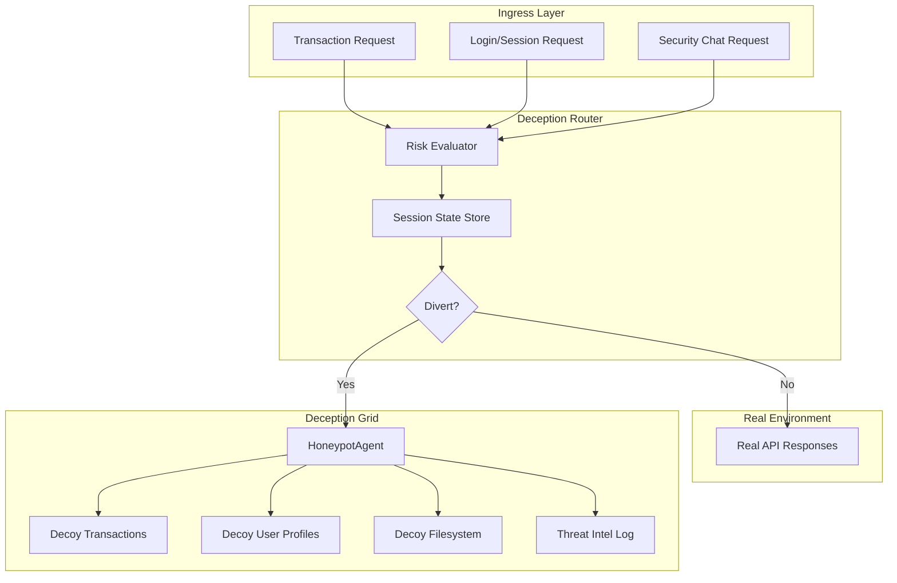

# Proactive Deception Grid — Adaptive Deception Defense Framework (ADDF)

## Current State vs Target

| Aspect             | Current                                       | Target                                                                           |
| ------------------ | --------------------------------------------- | -------------------------------------------------------------------------------- |
| **Trigger**        | Keyword matching in Security Chat only        | Risk-based: COMBINED_RISK_SCORE, AVG_RISK, session patterns                      |
| **Routing**        | Security chat → honeypot reply                | Transaction + login + chat → seamless diversion to decoy environment             |
| **Synthetic data** | Random-based transactions; static honeytokens | GenAI-generated, schema-mirroring, non-repetitive                                |
| **Decoy services** | Standalone honeypot endpoints                 | Dynamic layer: diverted sessions get decoy responses from real-looking endpoints |
| **Threat intel**   | Basic log_interaction                         | Tactic classification, FaaS pattern detection, structured export                 |

---

## Architecture Overview

---

## Implementation Plan

### 1. Deception Router and Session State

**New module:** `models/deception_router.py`

- **DeceptionRouter** class that:
  - Accepts `session_id`, `user_id`, `transaction_data`, `risk_score`, `source` (transaction | login | chat)
  - Uses configurable thresholds: `MEDIUM_RISK = 0.2`, `HIGH_RISK = 0.5` (align with [scripts/fix_agent_data.py](scripts/fix_agent_data.py) RISK_LEVEL logic)
  - Maintains in-memory (or Redis-ready) `diverted_sessions: Dict[session_id, DeceptionSession]` with timestamp, risk_score, first_trigger
  - Method `should_divert(session_id, risk_score, source) -> bool`: first medium-high risk triggers diversion for that session
  - Method `is_diverted(session_id) -> bool` for downstream routing

**Integration:** Inject router into API lifespan; pass to endpoints that need routing logic.

---

### 2. Risk-Based Trigger Points

**Transaction flow:** Add `POST /api/transactions/validate` (or extend existing flow)

- Accept `TransactionInput` + `session_id`
- Run feature engineering + fraud model (reuse [scripts/feature_engineering.py](scripts/feature_engineering.py) + RF model from [scripts/fix_agent_data.py](scripts/fix_agent_data.py))
- If `COMBINED_RISK_SCORE` > 20 (MEDIUM) or 50 (HIGH): call `DeceptionRouter.should_divert()` → if diverted, return decoy "authorized" response and log to threat intel
- If already diverted: always return decoy data, log interaction

**User risk lookup:** Modify `GET /api/user/{user_id}/risk`

- Add optional `session_id` query param
- If `DeceptionRouter.is_diverted(session_id)`: return synthetic user profile from HoneypotAgent instead of real data
- Log `DECOY_USER_PROFILE_ACCESS` to threat intel

**Security Chat:** Extend [api/main.py](api/main.py) lines 225–244

- Keep keyword check as fast path
- Add risk-based path: if `session_id` is diverted (from prior transaction/login), always use honeypot
- Optionally: call `tool_get_user_risk_profile()` for `user_id` in context; if AVG_RISK > 0.2, consider diversion

**High-risk transactions:** Modify `GET /api/fraud/high-risk`

- If request includes `session_id` (via header or cookie) and session is diverted: return decoy high-risk list from HoneypotAgent

---

### 3. GenAI-Enhanced Synthetic Data (HoneypotAgent)

**File:** [agents/honeypot_agent.py](agents/honeypot_agent.py)

**Upgrades:**

| Method                              | Change                                                                                                                                                                                                                                                                                                                                                                 |
| ----------------------------------- | ---------------------------------------------------------------------------------------------------------------------------------------------------------------------------------------------------------------------------------------------------------------------------------------------------------------------------------------------------------------------- |
| `generate_synthetic_transactions()` | Replace `random` with LLM prompt that includes schema: `TRANSACTION_ID`, `USER_ID`, `CATEGORY`, `MERCHANT`, `AMOUNT`, `COMBINED_RISK_SCORE`, `RISK_LEVEL`, `timestamp`. Use seed/context (e.g., `user_id`, `request_id`) to vary output. Return list of dicts matching [dataset/csv_data/fraud_scores_output.csv](dataset/csv_data/fraud_scores_output.csv) structure. |
| `generate_synthetic_account()`      | New method. Mirror [models/agent_tools_data.py](models/agent_tools_data.py) `tool_get_user_risk_profile` schema: `user_id`, `security_level`, `avg_risk`, `high_risk_count`, `txn_count`, `avg_combined_score`, `risk_distribution`. Use LLM to generate plausible values.                                                                                             |
| `generate_honeytoken()`             | Add `token_type="session"` for fake session tokens; use LLM to generate less predictable formats (avoid static `P@ssw0rd123!`).                                                                                                                                                                                                                                        |
| `generate_decoy_filesystem()`       | Already GenAI; add `seed` parameter to reduce repetition across calls.                                                                                                                                                                                                                                                                                                 |

**Schema reference for prompts:** Include column names and example values from `fraud_scores_output.csv` and `auth_profiles_output.csv` in LLM system context.

---

### 4. Decoy Micro-Services Layer

**Strategy:** Transparent decoy responses when session is diverted.

- **Middleware or dependency:** Create `get_response_for_diverted_session(session_id, endpoint, params)` used by key endpoints
- When diverted:
  - `/api/user/{user_id}/risk` → `HoneypotAgent.generate_synthetic_account(user_id)`
  - `/api/fraud/high-risk` → `HoneypotAgent.generate_synthetic_transactions("DECOY_USER", count=limit)` formatted as high-risk list
  - `/api/advisor/chat` (optional): return decoy financial advice from GenAI to keep attacker engaged
  - `/api/honeypot/`* — already decoy; ensure they log when accessed by diverted session

**New decoy endpoint:** `GET /api/decoy/internal/audit` — fake internal audit logs (GenAI), only reachable when attacker explores "deeper" (e.g., from deception response hints). Logs `AUDIT_EXPLORATION` to threat intel.

---

### 5. Threat Intelligence Enhancement

**Extend** `HoneypotAgent.log_interaction()` and add structured schema:

- **Fields:** `timestamp`, `session_id`, `action`, `details`, `honeypot_signal`, `tactic_category`, `faas_indicators`, `risk_score`
- **tactic_category:** Enum — `RECONNAISSANCE_CHAT`, `CREDENTIAL_PROBE`, `DATA_EXFILTRATION_ATTEMPT`, `AUDIT_EXPLORATION`, `DECOY_USER_PROFILE_ACCESS`, `DECOY_TXN_ACCESS`
- **faas_indicators:** List — `rapid_fire_requests`, `scripted_pattern`, `batch_user_probes` (detect via request timing, user_id patterns)
- **New method:** `classify_tactic(action, details) -> str` — use LLM to infer tactic from action + details
- **New method:** `detect_faas_pattern(session_logs) -> List[str]` — analyze recent logs for scripted behavior
- **Export:** `GET /api/honeypot/threat-intel` — JSON export of logs with tactic/faas fields for downstream SIEM or analysis

---

### 6. API and Schema Changes

**New schemas** in [api/schemas.py](api/schemas.py):

- `TransactionValidateRequest` (TransactionInput + session_id)
- `TransactionValidateResponse` (authorized: bool, risk_score, diverted: bool, decoy_txn_id if diverted)
- `ThreatIntelLogEntry` (extends HoneypotLogEntry with tactic_category, faas_indicators)
- `DeceptionSessionStatus` (is_diverted, risk_score, first_trigger_time)

**New endpoints:**

- `POST /api/transactions/validate` — transaction validation with risk-based diversion
- `GET /api/honeypot/threat-intel` — threat intel export
- `GET /api/decoy/internal/audit` — decoy audit logs (optional, for high-interaction lure)

**Modified endpoints:**

- `GET /api/user/{user_id}/risk` — add `X-Session-ID` or `session_id` query; return decoy when diverted
- `GET /api/fraud/high-risk` — same session check
- `POST /api/security/chat` — integrate DeceptionRouter for risk-based diversion

---

### 7. Streamlit / Frontend Integration

- Add `session_id` to API calls (e.g., from `st.session_state`) so diversion state persists across page views
- Optional: "Deception Mode" demo toggle to simulate diverted session for testing
- Security Analyst chat: pass `session_id` in `SecurityChatRequest`

---

## File Change Summary

| File                          | Action                                                                          |
| ----------------------------- | ------------------------------------------------------------------------------- |
| `models/deception_router.py`  | **Create** — DeceptionRouter, session state, thresholds                         |
| `agents/honeypot_agent.py`    | **Modify** — GenAI transactions/accounts, tactic classification, FaaS detection |
| `api/main.py`                 | **Modify** — Router integration, new endpoints, session-aware routing           |
| `api/schemas.py`              | **Modify** — New request/response models                                        |
| `models/agent_tools_data.py`  | **Minor** — Expose fraud model scoring for transaction validate (or add helper) |
| `scripts/verify_deception.py` | **Modify** — Add tests for risk-based diversion, threat intel export            |
| `streamlit_app.py`            | **Modify** — Pass session_id to API calls                                       |

---

## Risk Thresholds (from fix_agent_data.py)

- **LOW:** COMBINED_RISK_SCORE ≤ 20
- **MEDIUM:** 20 < score ≤ 50
- **HIGH:** 50 < score ≤ 80
- **CRITICAL:** score > 80

**Diversion trigger:** MEDIUM or higher (score > 20) on first detection for a session.

---

## Production Considerations

- **Session store:** In-memory dict is fine for demo; production should use Redis or similar for horizontal scaling
- **Rate limiting:** Decoy endpoints should not be rate-limited the same as real APIs (to avoid tipping off attackers)
- **LLM latency:** GenAI calls add latency; consider caching decoy responses per session or pre-generating pools
- **FaaS detection:** Implement request timing analysis (e.g., requests within 100ms) and batch user_id patterns in `detect_faas_pattern`

