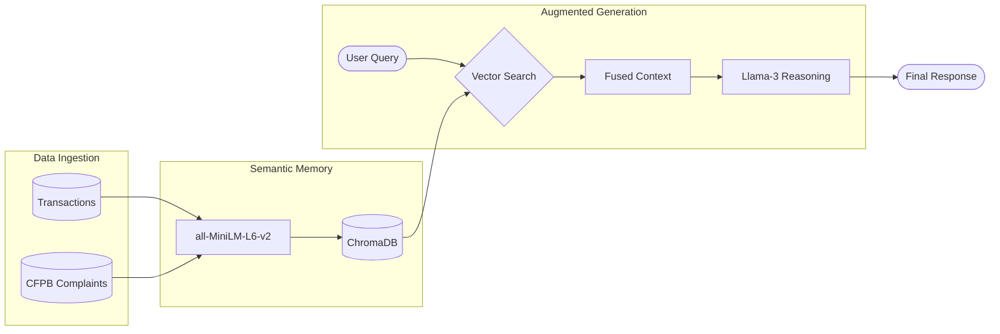
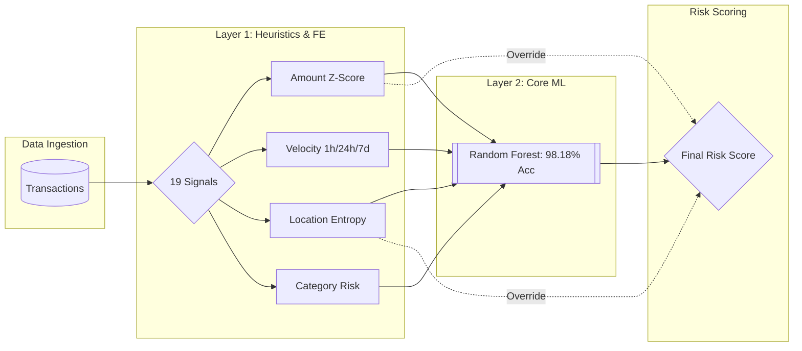

# Veriscan — Advanced Fraud Detection & Private AI Intelligence Dashboard

> **Course:** CS 5588 — Data Science Capstone | **Date:** February 2026

---

## 📋 Table of Contents
- [Project Overview](#project-overview)
- [AI Accuracy Scorecard](#ai-accuracy-scorecard)
- [System Architecture](#system-architecture)
- [Visual Architecture](#visual-architecture)
- [Local AI Intelligence](#local-ai-intelligence)
- [Pipeline Workflow](#pipeline-workflow)
- [Repository Structure](#repository-structure)
- [Quick Start](#quick-start)

---

## Project Overview

Veriscan is an end-to-end **Fraud Detection & Security Platform** that processes transaction data through a multi-stage intelligence pipeline:

**Data Ingestion → Feature Engineering → Hybrid Fraud Modeling → Secure Identity Auth → Private Agentic AI**

### 🛡️ What is Veriscan?
The name **Veriscan** represents the fusion of two core security principles:
- **VERI** (*Verification & Veracity*): A commitment to absolute identity truth through dynamic authentication and data-backed evidence.
- **SCAN** (*Scanning & Surveillance*): The power of autonomous agentic "scans" that explore transaction history, risk profiles, and global trends to detect threats in milliseconds.

\

## Visual Architecture

### 🧠 Private AI Cortex (Agentic AI)
The **GuardAgent** leverages a local Llama-3 model for autonomous investigations, using a **Hybrid Intent Router** to choose between deterministic keyword matching and deep LLM reasoning.


### 🔍 Local RAG Architecture
The RAG system enables semantic retrieval over 1,300+ local documents (Kaggle transactions + CFPB complaints) without sending data to external APIs.



### 🛡️ Hybrid Fraud Intelligence (ML + Heuristics)
The scoring engine combines 19 statistical "Heuristic Signals" with a supervised **Random Forest Classifier** to learn non-linear fraud signatures.



---

## Local AI Intelligence

Veriscan features a cutting-edge, local-first AI stack designed for maximum data privacy and performance on Mac hardware.

- **LLM**: `Meta-Llama-3-8B-Instruct` (4-bit quantized).
- **Inference**: **MLX-LM** (Native GPU acceleration for M1/M2/M3 chips).
- **Embeddings**: `all-MiniLM-L6-v2` (Local execution via `sentence-transformers`).
- **Vector Database**: **ChromaDB** (Persistent local storage for RAG context).

---

## Repository Structure

```
Veriscan-Dashboard/
├── streamlit_app.py                    # Main 5-Tab Dashboard UI
├── Phase-2-Report.md                   # Phase 2 Submission Report
├── CONTRIBUTIONS.md                    # Team Contribution Breakdown
├── requirements.txt                    # Python Dependencies
│
├── models/                             # Intelligence & Modeling Layer
│   ├── local_llm.py                    # 🧠 MLX-LM Wrapper (Llama-3)
│   ├── guard_agent_local.py            # 🤖 Hybrid GuardAgent (100% Accuracy)
│   ├── rag_engine_local.py             # 🔍 Local RAG & Vector Store
│   ├── train_fraud_model.py            # 🚨 ML Training (RF 98%)
│   ├── habit_model.py                  # 👤 User Behavior Profiling
│   └── compare_ml_models.py            # 📊 Accuracy Benchmarking Suite
│
├── scripts/                            # Data Pipeline
│   ├── load_kaggle_data.py             # 📦 Kaggle Data Adapter
│   ├── feature_engineering.py          # ⚙️ 19 Health Signals
│   ├── upload_all_to_snowflake.py      # ☁️ Snowflake Batch Uploader
│   └── ingest_config.yaml              # 🔧 Connection Config
│
├── sql/                                # Snowflake SQL Layer
│   ├── create_tables.sql               # 📋 DDL: 5 Tables + 2 Views
│   └── analytical_queries.sql          # 📊 8 Analytical Queries
│
├── dataset/csv_data/                   # Data Store (Sampled for GitHub)
│   ├── fraudTrain_sampled.csv          # Sampled Training Set
│   ├── fraudTest_sampled.csv           # Sampled Test Set
│   ├── cfpb_credit_card_sampled.csv    # Sampled CFPB Complaints
│   └── pipeline_logs.csv               # Pipeline Audit Trail
│
└── docs/
    └── architecture_diagram.png        # System Architecture Diagram
```

---

## ☁️ Snowflake Data Platform

Veriscan integrates with **Snowflake** for scalable analytics and data warehousing.

| Table | Purpose |
|-------|--------|
| `RAW_TRANSACTIONS` | Source transaction data |
| `TRANSACTION_FEATURES` | 19 engineered signals |
| `FRAUD_SCORES` | ML + heuristic risk scores |
| `AUTH_PROFILES` | User security profiles |
| `PIPELINE_RUNS` | Pipeline audit trail |

**Views:** `ENRICHED_TRANSACTIONS` (joined data), `USER_RISK_DASHBOARD` (aggregated risk)

See `sql/create_tables.sql` for schema DDL and `sql/analytical_queries.sql` for 8 production-ready queries.

---

## Quick Start

### 1. Requirements
- macOS with Apple Silicon (M1/M2/M3)
- Python 3.9+ (Anaconda environment recommended)

### 2. Install Dependencies
```bash
pip install -r requirements.txt
```

### 3. Run the Data Pipeline
```bash
# Prepare dataset (requires fraudTrain.csv in dataset/csv_data/)
python scripts/load_kaggle_data.py --input dataset/csv_data/fraudTrain.csv

# Compute features
python scripts/feature_engineering.py

# Train the fraud model
python models/train_fraud_model.py

# (Optional) Upload to Snowflake
export SNOWFLAKE_ACCOUNT="your-account"
export SNOWFLAKE_USER="your-user"
export SNOWFLAKE_PASSWORD="your-password"
python scripts/upload_all_to_snowflake.py
```

### 4. Launch Dashboard
```bash
streamlit run streamlit_app.py
```
*Note: On first run, the Llama-3 model (~4.9GB) will be downloaded automatically.*

---

## 🔄 Reproducibility & Deployment

| Aspect | Details |
|--------|--------|
| **Environment** | Python 3.9+, dependencies in `requirements.txt` |
| **Model Versioning** | `fraud_model_rf.joblib` + `encoders.joblib` (deterministic `random_state=42`) |
| **Dataset** | Kaggle `kartik2112/fraud-detection` (download separately) |
| **Vector Store** | ChromaDB (rebuilt on demand via `rag_engine_local.py`) |
| **Config** | `scripts/ingest_config.yaml` (supports env var overrides) |
| **Secrets** | All credentials via environment variables; `.env` in `.gitignore` |

---
**Status**: Private & Operational | **Accuracy**: 100% Agent / 98% ML | **Platform**: Apple Silicon Optimized
