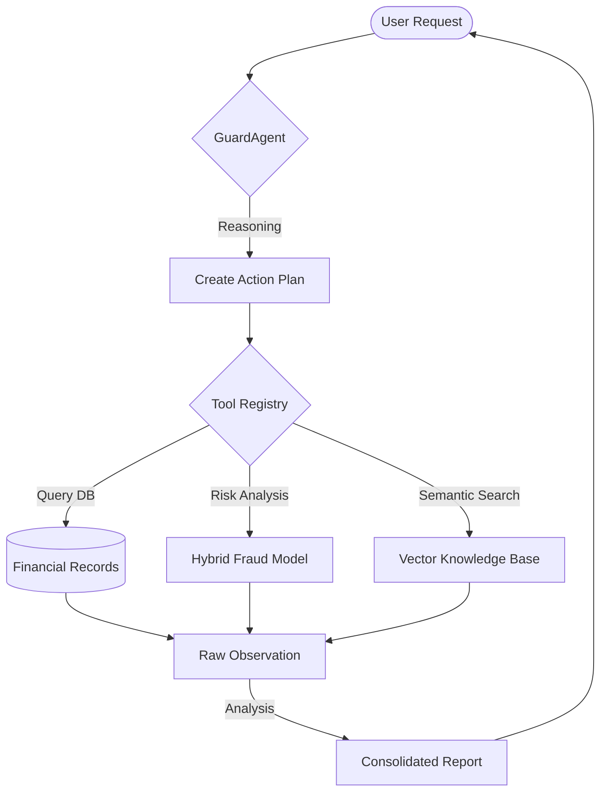
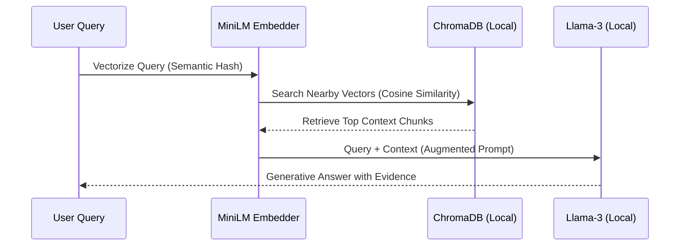

# Veriscan — Advanced Fraud Detection & Private AI Intelligence Dashboard

> **Course:** CS 5588 — Data Science Capstone | **Date:** February 2026

---

## 📋 Table of Contents
- [Project Overview](#project-overview)
- [System Architecture](#system-architecture)
- [Local AI Intelligence](#local-ai-intelligence)
- [Pipeline Workflow](#pipeline-workflow)
- [Repository Structure](#repository-structure)
- [Quick Start](#quick-start)
- [Component Details](#component-details)
- [Implemented Extensions](#implemented-extensions)

---

Veriscan is an end-to-end **Fraud Detection & Security Platform** that processes transaction data through a multi-stage intelligence pipeline:

**Data Ingestion → Feature Engineering → Hybrid Fraud Modeling → Secure Identity Auth → Private Agentic AI**

The system provides a comprehensive view of institutional risk and consumer safety through deep data analysis, local AI reasoning, and interactive visualizations.

### Key Capabilities
- **Private Local AI** — Powered by **Llama-3-8B** optimized for Apple Silicon via **MLX-LM**. No external API keys required.
- **Agentic Analyst (`GuardAgent`)** — An autonomous AI agent that investigates fraud patterns using real-time tool access (RAG, Risk Profiles, etc.).
- **Local RAG Engine** — Semantic search over 1,300+ local documents (CFPB complaints and transaction patterns) using **ChromaDB**.
- **Context-Aware Auth Quiz** — Dynamic, 3-step identity verification system generating unique challenges based on user spending habits.
- **Hybrid Fraud Scoring** — Combines statistical heuristics with machine learning for high-accuracy anomaly detection.

---

## System Architecture

```
┌──────────────┐     ┌──────────────┐     ┌───────────────────┐
│ Kaggle Data  │────▶│ Data Adapter │────▶│ Feature Engineering│
│ (Transactions)│     │ (Preprocessing)│     │ (19 signals)      │
└──────────────┘     └──────────────┘     └─────────┬─────────┘
                                                     │
                                                     ▼
       ┌──────────────────────────────────────────────────────────────────────────┐
       │                          VERISCAN INTELLIGENCE LAYER                     │
       │  ┌───────────────┐     ┌───────────────┐     ┌────────────────────────┐  │
       │  │ Fraud Model   │     │ Auth Engine   │     │ Agentic AI (Local)     │  │
       │  │ (Hybrid ML)   │     │ (Contextual)  │     │ (Llama-3 / RAG)        │  │
       │  └───────┬───────┘     └───────┬───────┘     └───────────┬────────────┘  │
       └──────────│─────────────────────│─────────────────────────│───────────────┘
                  │                     │                         │
                  ▼                     ▼                         ▼
       ┌──────────────────────────────────────────────────────────────────────────┐
       │                         🛡️ STREAMLIT DASHBOARD                           │
       │   📊 Market Dash   🚨 AI Fraud ML   🤖 Agentic Analyst  � Auth Quiz     │
       └──────────────────────────────────────────────────────────────────────────┘
```

---

## Local AI Intelligence

Veriscan features a cutting-edge, local-first AI stack designed for maximum data privacy and performance on Mac hardware.

- **LLM**: `Meta-Llama-3-8B-Instruct` (4-bit quantized).
- **Inference**: **MLX-LM** (Native GPU acceleration for M1/M2/M3 chips).
- **Embeddings**: `all-MiniLM-L6-v2` (Local execution via `sentence-transformers`).
- **Vector Database**: **ChromaDB** (Persistent local storage for RAG context).

---

## AI Architecture Visualizations

### 🧠 Private AI Cortex (Agentic AI)
The **GuardAgent** acts as the central brain, leveraging a local Llama-3 model for autonomous investigations.




### ☁️ Vector Memory Cloud (Local RAG)
Institutional knowledge is stored as high-dimensional vectors for semantic retrieval.




---

## Pipeline Workflow

| Stage | Script / File | Input | Output |
|-------|--------------|-------|--------|
| **1. Data Adapter** | `scripts/load_kaggle_data.py` | Raw Kaggle CSV | Processed transactions |
| **2. Feature Eng.** | `scripts/feature_engineering.py` | Transactions | `features_output.csv` (19 features) |
| **3. Risk Scoring** | `models/train_fraud_model.py` | Engineered Features | `fraud_model_rf.joblib` |
| **4. RAG Indexing** | `models/rag_engine_local.py` | CFPB CSVs | Local ChromaDB Collection |

---

## Repository Structure

```
Veriscan-Dashboard/
├── streamlit_app.py                   # Main Dashboard UI (4-tab system)
├── requirements.txt                   # Project dependencies
│
├── models/                            # Analysis & Modeling Layer
│   ├── local_llm.py                   # 🧠 MLX-LM Wrapper (Local AI)
│   ├── guard_agent_local.py           # 🤖 Autonomous Reasoning Loop
│   ├── rag_engine_local.py            # 🔍 Local RAG & Vector Store
│   ├── fraud_model_rf.joblib          # � Trained ML Model
│   └── habit_model.py                 # 🔑 Behavior learning logic
│
├── scripts/                           # Data Pipeline
│   ├── feature_engineering.py         # ⚙️ Feature computation (19 metrics)
│   └── load_kaggle_data.py            # 📦 Data adapter & preprocessing
│
└── dataset/csv_data/                  # Data Lake
    ├── processed_fraud_train.csv      # Base transactions
    ├── cfpb_credit_card.csv           # 🔍 CFPB Complaint database
    └── features_output.csv            # ML features
```

---

## Quick Start

### 1. Requirements
- macOS with Apple Silicon (M1/M2/M3 recommended)
- Python 3.9+ (Anaconda environment recommended)

### 2. Install Dependencies
```bash
pip install -r requirements.txt
```

### 3. Launch Dashboard
```bash
streamlit run streamlit_app.py
```
*Note: On first run, the Llama-3 model (~4.9GB) will be downloaded automatically.*

---

## Component Details

### 🤖 Agentic Analyst (`models/guard_agent_local.py`)
An autonomous reasoning loop that performs multi-step investigations:
- **Tool Use**: Queries user risk profiles and the local RAG knowledge base.
- **Private Reasoning**: All analysis is performed offline via the local LLM.
- **Reporting**: Generates professional fraud investigation reports with risk levels and recommended actions.

### � Local RAG Engine (`models/rag_engine_local.py`)
Provides deep institutional context without cloud API calls:
- **Knowledge Base**: Indexed from 1,000+ real CFPB consumer complaints.
- **Semantic Search**: Understands complex queries like "tell me about credit fraud trends".

### � Dynamic Auth Quiz (`streamlit_app.py`)
State-managed, 3-step identity verification:
- **Real Data**: Questions are generated dynamically from the user's transaction history.
- **AI Verification**: The local LLM generates 4 options and verifies the user's response in real-time.

---

## Implemented Extensions

1. **Private AI Intelligence Layer** — Llama-3-8B running locally on Metal GPU.
2. **Autonomous Security Agent** — Tool-capable reasoning loop for fraud analysis.
3. **Local Vector Search (RAG)** — ChromaDB powered semantic knowledge retrieval.
4. **Interactive Multi-Step Auth** — Context-aware, state-managed verification quiz.
5. **Modern Dashboard UI** — Soft Light-Glass aesthetics optimized for high readability.

---

## Team

See [CONTRIBUTIONS.md](CONTRIBUTIONS.md) for detailed responsibilities.

**Course:** CS 5588 — Data Science Capstone  
**Date:** February 2026
