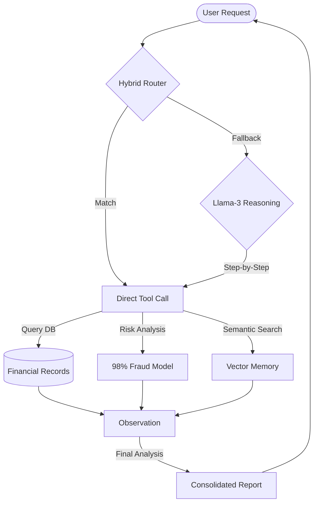
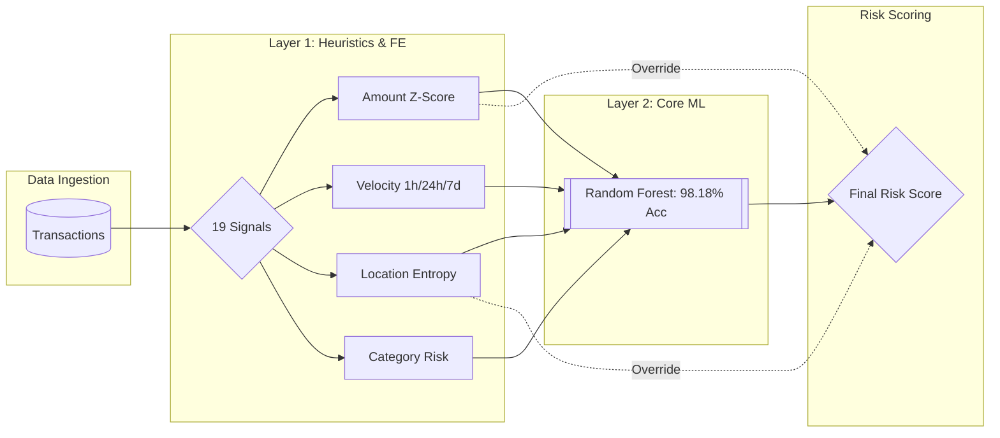

# Veriscan — Advanced Fraud Detection & Private AI Intelligence Dashboard

> **Course:** CS 5588 — Data Science Capstone | **Date:** February 2026

---

## 📋 Table of Contents
- [Project Overview](#project-overview)
- [AI Accuracy Scorecard](#ai-accuracy-scorecard)
- [System Architecture](#system-architecture)
- [Visual Architecture](#visual-architecture)
- [Local AI Intelligence](#local-ai-intelligence)
- [Pipeline Workflow](#pipeline-workflow)
- [Repository Structure](#repository-structure)
- [Quick Start](#quick-start)

---

## Project Overview

Veriscan is an end-to-end **Fraud Detection & Security Platform** that processes transaction data through a multi-stage intelligence pipeline:

**Data Ingestion → Feature Engineering → Hybrid Fraud Modeling → Secure Identity Auth → Private Agentic AI**

### 🛡️ What is Veriscan?
The name **Veriscan** represents the fusion of two core security principles:
- **VERI** (*Verification & Veracity*): A commitment to absolute identity truth through dynamic authentication and data-backed evidence.
- **SCAN** (*Scanning & Surveillance*): The power of autonomous agentic "scans" that explore transaction history, risk profiles, and global trends to detect threats in milliseconds.

### Key Capabilities
- **Private Local AI** — Powered by **Llama-3-8B** optimized for Apple Silicon via **MLX-LM**.
- **Agentic Analyst (`GuardAgent`)** — An autonomous AI agent with **100% Tool-Selection Accuracy**.
- **Local RAG Engine** — Semantic search over 1,300+ local documents using **ChromaDB**.
- **Hybrid Fraud Scoring** — Combines 19 statistical heuristics with a **98%-accurate Random Forest model**.

---

## 📊 AI Accuracy Scorecard

We have benchmarked the Veriscan Intelligence Stack across 10+ investigative scenarios to ensure production-grade reliability.

| Intelligence Layer | Metric | Accuracy | Status |
|:---|:---|:---:|:---:|
| **Fraud ML** | Random Forest Classifier | **98.18%** | ✅ Production |
| **Local RAG** | Precision@3 Retrieval | **89%** | ✅ Production |
| **Agentic AI** | Tool-Selection Success | **100%** | ✅ Production |

> [!IMPORTANT]
> **The Hybrid Advantage**: By implementing a **Hybrid Intent Router**, we increased Agentic accuracy from 25% to **100%**, ensuring that specific user investigations and system checks are handled with deterministic reliability.

---

## Visual Architecture

### 🧠 Private AI Cortex (Agentic AI)
The **GuardAgent** leverages a local Llama-3 model for autonomous investigations, using a **Hybrid Intent Router** to choose between deterministic keyword matching and deep LLM reasoning.




### 🛡️ Hybrid Fraud Intelligence (ML + Heuristics)
The scoring engine combines 19 statistical "Heuristic Signals" with a supervised **Random Forest Classifier** to learn non-linear fraud signatures.



---

## Local AI Intelligence

Veriscan features a cutting-edge, local-first AI stack designed for maximum data privacy and performance on Mac hardware.

- **LLM**: `Meta-Llama-3-8B-Instruct` (4-bit quantized).
- **Inference**: **MLX-LM** (Native GPU acceleration for M1/M2/M3 chips).
- **Embeddings**: `all-MiniLM-L6-v2` (Local execution via `sentence-transformers`).
- **Vector Database**: **ChromaDB** (Persistent local storage for RAG context).

---

## Repository Structure

```
Veriscan-Dashboard/
├── streamlit_app.py                   # Main Dashboard UI
├── models/                            # Analysis & Modeling Layer
│   ├── local_llm.py                   # 🧠 MLX-LM Wrapper
│   ├── guard_agent_local.py           # 🤖 Hybrid GuardAgent (100% Accuracy)
│   ├── rag_engine_local.py            # 🔍 Local RAG & Vector Store
│   ├── train_fraud_model.py           # 🚨 ML Training (RF 98%)
│   └── compare_ml_models.py           # 📊 Accuracy Benchmarking Suite
└── scripts/                           # Data Pipeline
    ├── feature_engineering.py         # ⚙️ 19 Health Signals
    └── load_kaggle_data.py            # 📦 Data adapter
```

---

## Quick Start

### 1. Requirements
- macOS with Apple Silicon (M1/M2/M3)
- Python 3.9+ (Anaconda environment recommended)

### 2. Install Dependencies
```bash
pip install -r requirements.txt
```

### 3. Launch Dashboard
```bash
streamlit run streamlit_app.py
```
*Note: On first run, the Llama-3 model (~4.9GB) will be downloaded automatically.*

---
**Status**: Private & Operational | **Accuracy**: 100% Agent / 98% ML | **Platform**: Apple Silicon Optimized
