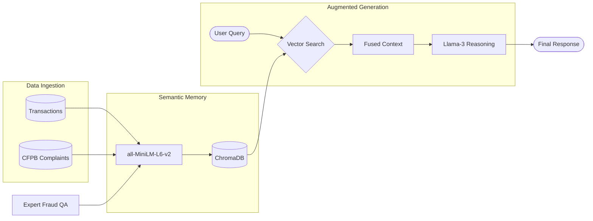
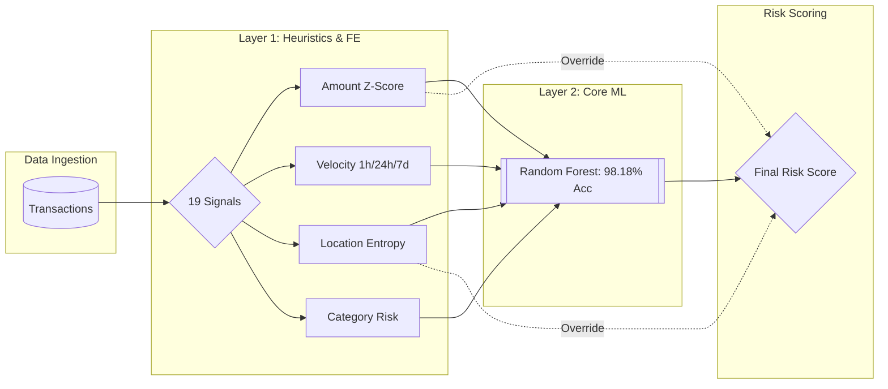
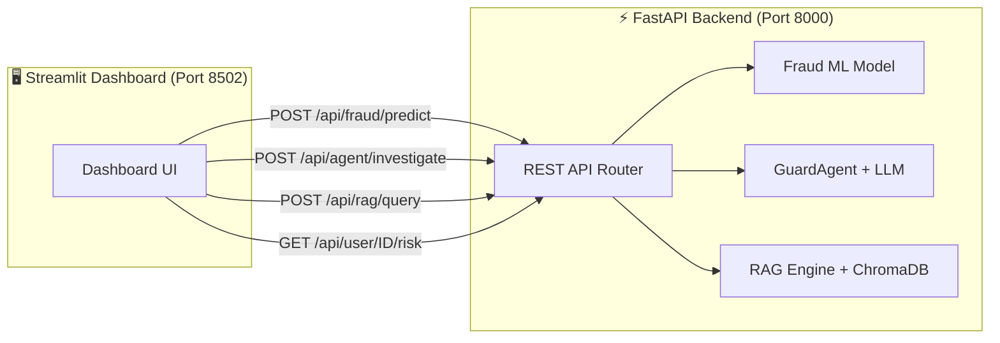

# Veriscan — Advanced Fraud Detection & Private AI Intelligence Dashboard

> **Course:** CS 5588 — Data Science Capstone | **Date:** February 2026

---

## 📋 Table of Contents
- [Project Overview](#project-overview)
- [System Architecture](#system-architecture)
- [Visual Architecture](#visual-architecture)
- [Local AI Intelligence](#local-ai-intelligence)
- [Pipeline Workflow](#pipeline-workflow)
- [Repository Structure](#repository-structure)
- [Quick Start](#quick-start)

---

## Project Overview

Veriscan is an end-to-end **Fraud Detection & Security Platform** that processes transaction data through a multi-stage intelligence pipeline:

**Data Ingestion → Feature Engineering → Hybrid Fraud Modeling → Secure Identity Auth → Private Agentic AI**

### 🛡️ What is Veriscan?
The name **Veriscan** represents the fusion of two core security principles:
- **VERI** (*Verification & Veracity*): A commitment to absolute identity truth through dynamic authentication and data-backed evidence.
- **SCAN** (*Scanning & Surveillance*): The power of autonomous agentic "scans" that explore transaction history, risk profiles, and global trends to detect threats in milliseconds.

\

## Visual Architecture

### 🧠 Private AI Cortex (Modular Multi-Agent System)
Veriscan has been upgraded to a **Modular Clean Architecture**. The **GuardAgent** acts as a facade, delegating tasks to specialized, stateful agents:
- **KnowledgeAgent:** Expert synthesis of fraud intelligence using multi-stage RAG.
- **RiskScannerAgent:** Instant system-wide health checks and threat scanning.
- **ProfileAgent:** Deep-dive investigation into specific user risk behaviors.
- **SynthesisAgent:** Orchestrates complex reasoning, integrating memory and multiple tools into structured 300+ word reports.
- **Stateful Memory:** All agents now support **ConversationMemory**, enabling context-aware follow-up questions within the same session.


### 🔍 Multi-Stage RAG Architecture
The RAG system features a **Multi-Stage Retrieval** pipeline over **1,400+ local documents**. It uses semantic search followed by a **Re-ranking Layer** that prioritizes high-confidence Expert Fraud Intelligence (100+ expert QA pairs) over raw transaction context.



### 🛡️ Hybrid Fraud Intelligence (ML + Heuristics)
The scoring engine combines 19 statistical "Heuristic Signals" with a supervised **Random Forest Classifier** to learn non-linear fraud signatures.



---

## Local AI Intelligence

Veriscan features a cutting-edge, local-first AI stack designed for maximum data privacy and performance on Mac hardware.

- **LLM**: `Meta-Llama-3-8B-Instruct` (4-bit quantized).
- **Inference**: **MLX-LM** (Native GPU acceleration for M1/M2/M3 chips).
- **Embeddings**: `all-MiniLM-L6-v2` (Local execution via `sentence-transformers`).
- **Vector Database**: **ChromaDB** (Persistent local storage for RAG context).

---

## Repository Structure

```
Veriscan-Dashboard/
├── streamlit_app.py                    # Aggregator UI (Consumes Microservices)
├── api/                                # ⚡ FastAPI Microservices Layer
│   ├── main.py                         # REST API Router & Endpoints
│   └── schemas.py                      # Pydantic Data Models
├── Phase-2-Report.md                   # Technical Report
├── CONTRIBUTIONS.md                    # Team Breakdown
├── requirements.txt                    # Project Dependencies
│
├── agents/                             # 🤖 Modular Agent System (Clean Architecture)
│   ├── base.py                         # Standardized Agent Interfaces
│   ├── memory.py                       # 🧠 Stateful Conversation Memory
│   ├── knowledge.py                    # RAG-Powered Knowledge Specialist
│   ├── scanner.py                      # System-Wide Risk Specialist
│   ├── profile.py                      # User Investigation Specialist
│   └── synthesis.py                    # Multi-Tool Reasoning Specialist
│
├── models/                             # Intelligence & Core Logic Layer
│   ├── local_llm.py                    # 🧠 MLX-LM Wrapper (Llama-3)
│   ├── guard_agent_local.py            # 🛡️ GuardAgent Facade (Multi-Agent Router)
│   ├── rag_engine_local.py             # 🔍 RAG Engine (with Multi-Stage Re-ranking)
│   ├── train_fraud_model.py            # 🚨 ML Training (RF 98%)
│   └── hash_utils.py                   # Security Utilities
│
├── scripts/                            # Data Pipeline
│   ├── load_kaggle_data.py             # 📦 Kaggle Data Adapter
│   ├── feature_engineering.py          # ⚙️ 19 Health Signals
│   ├── upload_all_to_snowflake.py      # ☁️ Snowflake Batch Uploader
│   └── ingest_config.yaml              # 🔧 Connection Config
│
├── sql/                                # Snowflake SQL Layer
│   ├── create_tables.sql               # 📋 DDL: 5 Tables + 2 Views
│   └── analytical_queries.sql          # 📊 8 Analytical Queries
│
├── dataset/csv_data/                   # Data Store (Sampled for GitHub)
│   ├── fraudTrain_sampled.csv          # Sampled Training Set
│   ├── fraudTest_sampled.csv           # Sampled Test Set
│   ├── cfpb_credit_card.csv            # CFPB Complaints Base
│   ├── fraud_detection_qa_dataset.json  # 💡 Expert Intelligence Dataset
│   └── pipeline_logs.csv               # Pipeline Audit Trail
│
└── docs/
    └── architecture_diagram.png        # System Architecture Diagram
```

---

## ☁️ Snowflake Data Platform

Veriscan integrates with **Snowflake** for scalable analytics and data warehousing.

| Table | Purpose |
|-------|--------|
| `RAW_TRANSACTIONS` | Source transaction data |
| `TRANSACTION_FEATURES` | 19 engineered signals |
| `FRAUD_SCORES` | ML + heuristic risk scores |
| `AUTH_PROFILES` | User security profiles |
| `PIPELINE_RUNS` | Pipeline audit trail |

**Views:** `ENRICHED_TRANSACTIONS` (joined data), `USER_RISK_DASHBOARD` (aggregated risk)

See `sql/create_tables.sql` for schema DDL and `sql/analytical_queries.sql` for 8 production-ready queries.

---

## 🚀 Microservices Architecture

Veriscan uses a **decoupled microservices architecture**. The ML, RAG, and Agentic AI components run as a standalone **FastAPI backend**, and the Streamlit dashboard consumes them via REST API.



### API Endpoints

| Method | Endpoint | Description |
|--------|----------|-------------|
| `GET` | `/api/health` | Health check & loaded services |
| `POST` | `/api/fraud/predict` | Single-transaction fraud prediction |
| `GET` | `/api/fraud/high-risk?limit=N` | Top N riskiest transactions |
| `GET` | `/api/user/{user_id}/risk` | User risk profile |
| `POST` | `/api/agent/investigate` | Full agentic investigation (Supports `session_id`) |
| `POST` | `/api/rag/query` | Semantic knowledge search (Multi-stage re-ranking) |

---

## Quick Start

### 1. Requirements
- macOS with Apple Silicon (M1/M2/M3)
- Python 3.9+ (Anaconda environment recommended)

### 2. Install Dependencies
```bash
pip install -r requirements.txt
```

### 3. Run the Data Pipeline
```bash
# Prepare dataset (requires fraudTrain.csv in dataset/csv_data/)
python scripts/prepare_fraud_data.py

# Train the fraud model
python models/train_fraud_model.py

# Sync agent data files
python scripts/fix_agent_data.py
```

### 4. Launch the API Backend
```bash
uvicorn api.main:app --host 0.0.0.0 --port 8000
```

### 5. Launch the Dashboard (separate terminal)
```bash
streamlit run streamlit_app.py --server.port 8502
```
*Note: On first run, the Llama-3 model (~4.9GB) will be downloaded automatically.*

---

## 🔄 Reproducibility & Deployment

| Aspect | Details |
|--------|--------|
| **Environment** | Python 3.9+, dependencies in `requirements.txt` |
| **Model Versioning** | `fraud_model_rf.joblib` + `encoders.joblib` (deterministic `random_state=42`) |
| **Dataset** | Kaggle `kartik2112/fraud-detection` (download separately). Note: The preparation script now utilizes **5x Fraud Oversampling** to ensure sufficient risk events scale for downstream analytics. |
| **Vector Store** | ChromaDB (rebuilt on demand via `rag_engine_local.py`) |
| **Config** | `scripts/ingest_config.yaml` (supports env var overrides) |
| **Secrets** | All credentials via environment variables; `.env` in `.gitignore` |

---
**Status**: Private & Operational | **Accuracy**: 100% Agent / 98% ML | **Platform**: Apple Silicon Optimized
