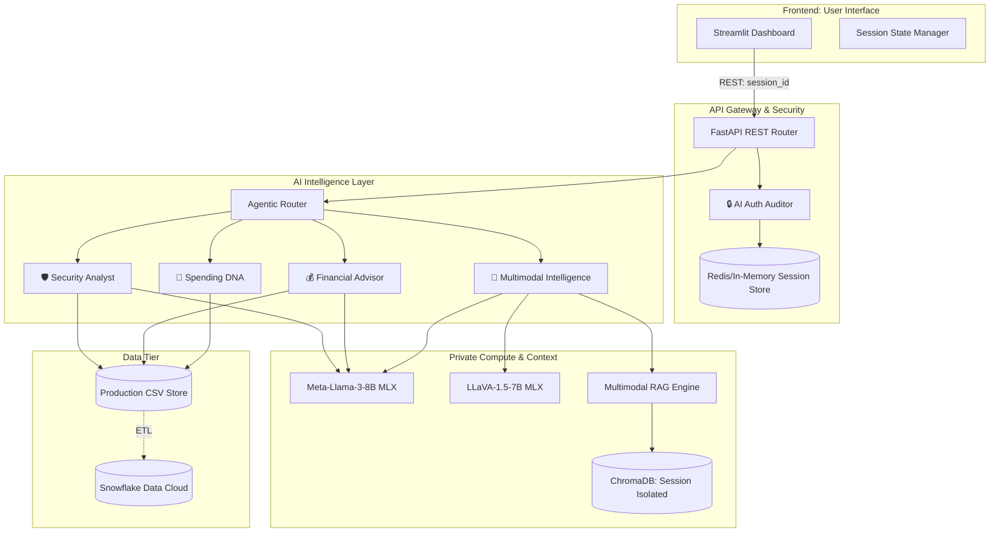
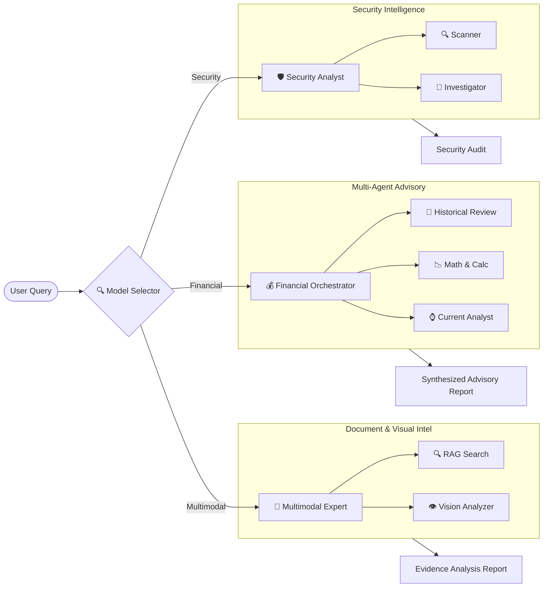
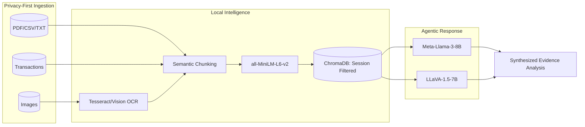
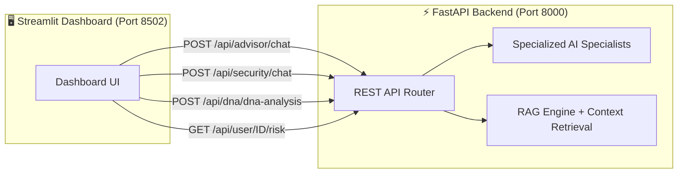

# Veriscan-Cortex — Advanced Fraud Intelligence & Private Multi-Agent Dashboard

> **Course:** CS 5588 — Data Science Capstone | **Date:** February 2026

---

## 📋 Table of Contents
- [Project Overview](#project-overview)
- [System Architecture](#system-architecture)
- [Visual Architecture](#visual-architecture)
- [Local AI Intelligence](#local-ai-intelligence)
- [Pipeline Workflow](#pipeline-workflow)
- [Repository Structure](#repository-structure)
- [Quick Start](#quick-start)

---

## Project Overview

Veriscan is an end-to-end **Fraud Detection & Security Platform** that processes transaction data through a multi-stage intelligence pipeline:

**Data Ingestion → Feature Engineering → Hybrid Fraud Modeling → Secure Identity Auth → Private Agentic AI**

### 🛡️ What is Veriscan?
The name **Veriscan** represents the fusion of two core security principles:
- **VERI** (*Verification & Veracity*): A commitment to absolute identity truth through dynamic authentication and data-backed evidence.
- **SCAN** (*Scanning & Surveillance*): The power of autonomous agentic "scans" that explore transaction history, risk profiles, and now personalized financial advice.

### 🌟 Premium AI Specialized Agents
The dashboard features a triple-agent specialization for mission-critical tasks:
1. **🛡️ Security AI Analyst**: Dedicated to real-time fraud detection, system shield monitoring, and anomaly detection protocols.
2. **💰 Financial AI Advisor**: A high-fidelity agent providing advisory reports on credit health, savings plans, and spending optimization.
3. **🧬 Multimodal Intelligence**: A local RAG-powered agent that processes any evidence: PDFs, Images (via OCR & Vision), CSVs, and Transcripts. 
4. **🧠 Vision-LLM Analysis**: Direct integration with LLaVA for visual reasoning and document extraction.
5. **🧬 Spending DNA**: An 8-axis behavioral fingerprinting system for identity verification and trust scoring.


## 🏗️ Production System Architecture

Veriscan-Cortex is architected as a **high-availability, privacy-first multi-agent system**. The architecture is decoupled into distinct layers to ensure scalability and secure data isolation.

### 🌐 Unified Architectural Flow

```mermaid
graph TD
    subgraph Client_Layer [Frontend: User Interface]
        UI[Streamlit Dashboard]
        Session[Session State Manager]
    end

    subgraph API_Gateway [API Gateway & Security]
        FastAPI[FastAPI REST Router]
        AuthA[🔒 AI Auth Auditor]
        SessionStore[(Redis/In-Memory Session Store)]
    end

    subgraph Intelligence_Orchestrator [AI Intelligence Layer]
        Router[Agentic Router]
        SecAgent[🛡️ Security Analyst]
        FinAgent[💰 Financial Advisor]
        MultiAgent[🧬 Multimodal Intelligence]
        DNAAgent[🧬 Spending DNA]
    end

    subgraph Memory_Compute [Private Compute & Context]
        LLM[Meta-Llama-3-8B MLX]
        VisionLLM[LLaVA-1.5-7B MLX]
        RAG[Multimodal RAG Engine]
        VectorDB[(ChromaDB: Session Isolated)]
    end

    subgraph Persistence [Data Tier]
        Snowflake[(Snowflake Data Cloud)]
        LocalCSV[(Production CSV Store)]
    end

    UI -->|REST: session_id| FastAPI
    FastAPI --> AuthA
    AuthA --> SessionStore
    FastAPI --> Router
    Router --> SecAgent & FinAgent & MultiAgent & DNAAgent
    SecAgent & FinAgent & MultiAgent --> LLM
    MultiAgent --> VisionLLM
    MultiAgent --> RAG
    RAG --> VectorDB
    SecAgent & FinAgent & DNAAgent --> LocalCSV
    LocalCSV -.->|ETL| Snowflake
```

### 🔒 Security & Session Lifecycle
In a production environment, Veriscan prioritizes **Identity Veracity**:
- **Auth Auditor**: Every authentication request (Login) is intercepted by the Auth Auditor agent. It computes a **Login Risk Score** before assigning a globally unique `session_id`.
- **State Propagation**: The `session_id` is propagated through all microservices, ensuring that agentic memory remains isolated and consistent for the duration of the user session.
- **Zero-Trust RAG**: Multimodal evidence (PDFs, Images, CSVs) is processed entirely within the local compute environment. Embeddings and raw extracted data never leave the host machine, matching Tier-1 financial data privacy standards.

### 🧩 Production Layer Specifications

| Layer | Responsibility | Technology Stack |
|-------|----------------|------------------|
| **Client** | High-fidelity visualization | Streamlit, Plotly Express |
| **Gateway** | Session management & routing | FastAPI, Pydantic v2 |
| **Multimodal** | Image/Doc analysis | PyTesseract, PyPDF, LLaVA |
| **Inference** | Local accelerated LLM | MLX-LM (M-series Compatible) |
| **RAG** | Session isolated retrieval | ChromaDB (Metadata filtering) |

---

## Visual Architecture

### 🧠 How the AI "Brain" Works
Veriscan-Cortex works like a professional security team. Instead of one slow AI doing everything, we used **specialized agents** that work together in a split second.


```mermaid
graph LR
    User([User Query]) --> ModelSelector{🔍 Model Selector}
    
    ModelSelector -->|Security| SecAnalyst[🛡️ Security Analyst]
    ModelSelector -->|Financial| FinOrchestrator[💰 Financial Orchestrator]
    ModelSelector -->|Multimodal| MultiAnalyst[🧬 Multimodal Expert]

    subgraph Security_Domain [Security Intelligence]
        direction LR
        SecAnalyst --> Scanner[🔍 Scanner]
        SecAnalyst --> Profile[👤 Investigator]
    end

    subgraph Financial_Domain [Multi-Agent Advisory]
        direction LR
        FinOrchestrator --> HistAgent["📜 Historical Review"]
        FinOrchestrator --> CalcAgent["📉 Math & Calc"]
        FinOrchestrator --> CurrAgent["⌚ Current Analyst"]
    end

    subgraph Multimodal_Domain [Document & Visual Intel]
        direction LR
        MultiAnalyst --> RAG[🔍 RAG Search]
        MultiAnalyst --> Vision[👁️ Vision Analyzer]
    end

    Security_Domain --> Report[Security Audit]
    Financial_Domain --> Report2[Synthesized Advisory Report]
    Multimodal_Domain --> Report3[Evidence Analysis Report]
```

| Agent | Role | "The Personality" | Specialized Tools |
| :--- | :--- | :--- | :--- |
| **Orchestrator** | The Project Manager | Coordinates specialized sub-agents to build a cohesive financial report. | Multi-agent synthesis |
| **Historical Review** | The Archivist | Analyzes long-term spending patterns and historical category trends. | `tool_monthly_comparison` |
| **Math & Calculation**| The Accountant | Performs precision math on transaction totals, averages, and deviations. | `tool_cash_flow_forecast`, `tool_surplus_optimizer` |
| **Current Analyst** | The Real-Time Monitor | Focuses on the most recent transactions and immediate spending behavior. | `tool_detect_price_hikes`, `tool_tax_deductible_finder` |
| **Multimodal Expert**| The Evidence Specialist| Analyzes uploaded documents, images, and CSVs using RAG and Vision LLM. | `tool_semantic_search`, `tool_vision_ocr`, `tool_csv_summarizer` |
| **Scanner** | The Watchman | Scans the whole system for high-risk threats in milliseconds. | `tool_realtime_fraud_check` |
| **Profile** | The Private Eye | Looks deep into a specific user's history and risk scores. | `tool_credit_score_impact` |

### 📄 Multi-Stage Multimodal RAG Architecture
The RAG system features a **Session-Isolated Multimodal** pipeline. Users can index any evidence (PDF bank statements, JPG receipts, CSV finance data). It uses semantic search with `all-MiniLM-L6-v2` and incorporates the **Vision LLM** for visual reasoning.


```mermaid
graph LR
    subgraph Ingestion [Privacy-First Ingestion]
        Docs[(PDF/CSV/TXT)]
        IMG[(Images)]
        TXN[(Transactions)]
    end

    subgraph RAG_Engine [Local Intelligence]
        direction TB
        OCR[Tesseract/Vision OCR]
        Chunk[Semantic Chunking]
        Embed[all-MiniLM-L6-v2]
        Chroma[(ChromaDB: Session Filtered)]
    end

    subgraph Inference [Agentic Response]
        LLM[Meta-Llama-3-8B]
        Vision[LLaVA-1.5-7B]
    end

    Docs & TXN --> Chunk
    IMG --> OCR
    OCR --> Chunk
    Chunk --> Embed
    Embed --> Chroma
    Chroma --> LLM & Vision
    LLM & Vision --> Reply[Synthesized Evidence Analysis]
```

## Local AI Intelligence

Veriscan features a cutting-edge, local-first AI stack designed for maximum data privacy and performance on Mac hardware.

- **Text LLM**: `Meta-Llama-3-8B-Instruct` (MLX/4-bit).
- **Vision LLM**: `LLaVA-1.5-7B` (MLX/4-bit).
- **Inference**: **MLX-LM** (Native GPU acceleration for Apple Silicon).
- **Embeddings**: `all-MiniLM-L6-v2`.
- **Vector Database**: **ChromaDB** (Session-isolated metadata filtering).

---

## Repository Structure

```
Veriscan-Dashboard/
├── streamlit_app.py                    # Aggregator UI (Consumes Microservices)
├── api/                                # ⚡ FastAPI Microservices Layer
│   ├── main.py                         # REST API Router & Endpoints
│   └── schemas.py                      # Pydantic Data Models
├── Phase-2-Report.md                   # Technical Report
├── CONTRIBUTIONS.md                    # Team Breakdown
├── requirements.txt                    # Project Dependencies
│
├── agents/                             # 🤖 Specialized AI Agents
│   ├── base.py                         # Standardized Agent Interfaces
│   ├── financial_advisor_agent.py      # 💰 Financial Advisor Specialist
│   ├── memory.py                       # 🧠 Stateful Conversation Memory
│   └── spending_dna_agent.py           # 🧬 Behavioral Fingerprinting Agent
│
├── models/                             # Intelligence & Core Logic Layer
│   ├── local_llm.py                    # 🧠 MLX-LM Wrapper (Llama-3)
│   ├── guard_agent_local.py            # 🛡️ Security Analyst Facade
│   ├── rag_engine_local.py             # 🔍 RAG Engine (Local Indexing)
│   └── agent_tools_data.py             # ⚙️ Data Tools for Risk & Profiles
│
├── scripts/                            # Data Pipeline & Synthetic Data
│   ├── feature_engineering.py          # ⚙️ 19 Health Signals
│   ├── fix_agent_data.py               # 🩹 Data Reconciliation Utility
│   ├── generate_cfpb_dataset.py        # 🏦 Synthetic CFPB Compliant Data
│   ├── generate_financial_advisor_dataset.py # 💸 Advisor Context Generator
│   └── generate_spending_dna_dataset.py # 🧬 DNA Vector Generator
│
├── sql/                                # Snowflake SQL Layer
│   ├── create_tables.sql               # 📋 DDL: 5 Tables + 2 Views
│   └── analytical_queries.sql          # 📊 8 Analytical Queries
│
├── dataset/csv_data/                   # Production-Ready Data Store
│   ├── financial_advisor_dataset.csv   # 💰 Advisor Data (90k Rows, Online-Skewed)
│   ├── spending_dna_dataset.csv        # 🧬 DNA Trace Data (90k Rows)
│   ├── fraud_detection_qa_dataset.json # 💡 Expert Intelligence Dataset
│   ├── fraud_scores_output.csv         # 🛡️ Hybrid ML Fraud Scores
│   ├── top10_scam_types_by_losses.csv  # 📊 Market Contextual Data
│   └── pipeline_logs.csv               # Pipeline Audit Trail
│
├── dataset/pdf_data/                   # Local RAG Knowledge Base
│   ├── 2024_IC3Report.pdf              # Global Cybercrime Intelligence
│   └── The-Scam-Economy.pdf            # Expert Market Research
│
└── docs/
    └── architecture_diagram.png        # System Architecture Diagram
```

---

## ☁️ Snowflake Data Platform

Veriscan integrates with **Snowflake** for scalable analytics and data warehousing.

| Table | Purpose |
|-------|--------|
| `RAW_TRANSACTIONS` | Source transaction data |
| `TRANSACTION_FEATURES` | 19 engineered signals |
| `FRAUD_SCORES` | ML + heuristic risk scores |
| `AUTH_PROFILES` | User security profiles |
| `PIPELINE_RUNS` | Pipeline audit trail |

**Views:** `ENRICHED_TRANSACTIONS` (joined data), `USER_RISK_DASHBOARD` (aggregated risk)

See `sql/create_tables.sql` for schema DDL and `sql/analytical_queries.sql` for 8 production-ready queries.

---

## 🚀 Microservices Architecture

Veriscan uses a **decoupled microservices architecture**. The ML, RAG, and Agentic AI components run as a standalone **FastAPI backend**, and the Streamlit dashboard consumes them via REST API.


```mermaid
graph LR
    subgraph Frontend ["🖥️ Streamlit Dashboard (Port 8502)"]
        UI[Dashboard UI]
    end

    subgraph Backend ["⚡ FastAPI Backend (Port 8000)"]
        API[REST API Router]
        Agent[Specialized AI Specialists]
        RAG[RAG Engine + Context Retrieval]
    end

    UI -->|POST /api/advisor/chat| API
    UI -->|POST /api/security/chat| API
    UI -->|POST /api/dna/dna-analysis| API
    UI -->|GET /api/user/ID/risk| API
    API --> Agent
    API --> RAG
```

### API Endpoints

| `GET` | `/api/health` | Health check & loaded services (advisor, guard, DNA) |
| `POST` | `/api/rag/upload` | Multi-file PDF upload and local indexing |
| `POST` | `/api/rag/chat` | Context-aware chat with indexed documents |
| `POST` | `/api/llm/generate` | Direct Llama-3 inference endpoint |
| `POST` | `/api/fraud/predict` | Single-transaction fraud prediction |
| `GET` | `/api/fraud/high-risk` | Top riskiest transactions |
| `GET` | `/api/user/{user_id}/risk` | User risk profile |

---

## Quick Start

### 1. Requirements
- macOS with Apple Silicon (M1/M2/M3)
- Python 3.9+ (Anaconda environment recommended)

### 2. Install Dependencies
```bash
pip install -r requirements.txt
```

### 3. Run the Data Pipeline
```bash
# Prepare dataset (requires fraudTrain.csv in dataset/csv_data/)
python scripts/prepare_fraud_data.py

# Train the fraud model
python models/train_fraud_model.py

# Sync agent data files
python scripts/fix_agent_data.py
```

### 4. Launch the API Backend
```bash
uvicorn api.main:app --host 0.0.0.0 --port 8000
```

### 5. Launch the Dashboard (separate terminal)
```bash
streamlit run streamlit_app.py --server.port 8502
```
*Note: On first run, the Llama-3 model (~4.9GB) will be downloaded automatically.*

---

## 🔄 Reproducibility & Deployment

| Aspect | Details |
|--------|--------|
| **Environment** | Python 3.9+, dependencies in `requirements.txt` |
| **Model Versioning** | `fraud_model_rf.joblib` + `encoders.joblib` (deterministic `random_state=42`) |
| **Dataset** | Kaggle `kartik2112/fraud-detection` (download separately). Note: The preparation script now utilizes **5x Fraud Oversampling** to ensure sufficient risk events scale for downstream analytics. |
| **Vector Store** | ChromaDB (rebuilt on demand via `rag_engine_local.py`) |
| **Config** | `scripts/ingest_config.yaml` (supports env var overrides) |
| **Secrets** | All credentials via environment variables; `.env` in `.gitignore` |

## 🛡️ Project Data Realism
The Veriscan dataset engine has been specifically designed to reflect modern fraud profiles. 

- **78% Online Skew**: In alignment with current market research, 78% of simulated fraud monetary losses are clustered in **Online Shopping** and **Electronics** categories.
- **Scale**: The system generates **90,000 transactions** across 1,000 distinct user archetypes.
- **DNA Fingerprinting**: Every transaction is mapped to an 8-axis behavioral vector, allowing for 1-to-N identity verification with a high-confidence trust score.

### Source
https://consumerfed.org/press_release/americans-estimated-to-lose-119-billion-annually-to-online-scams/
