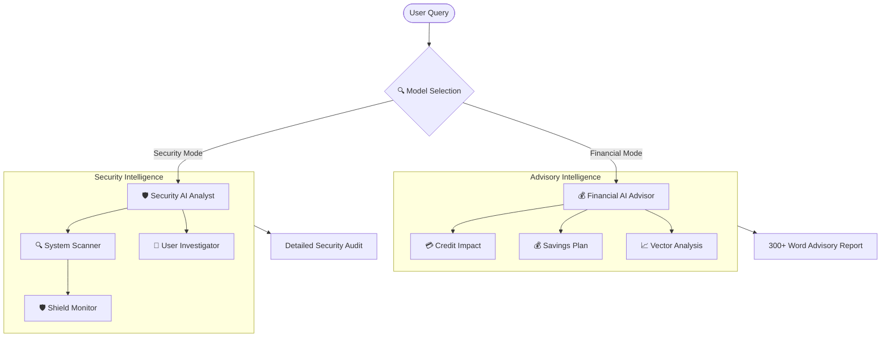
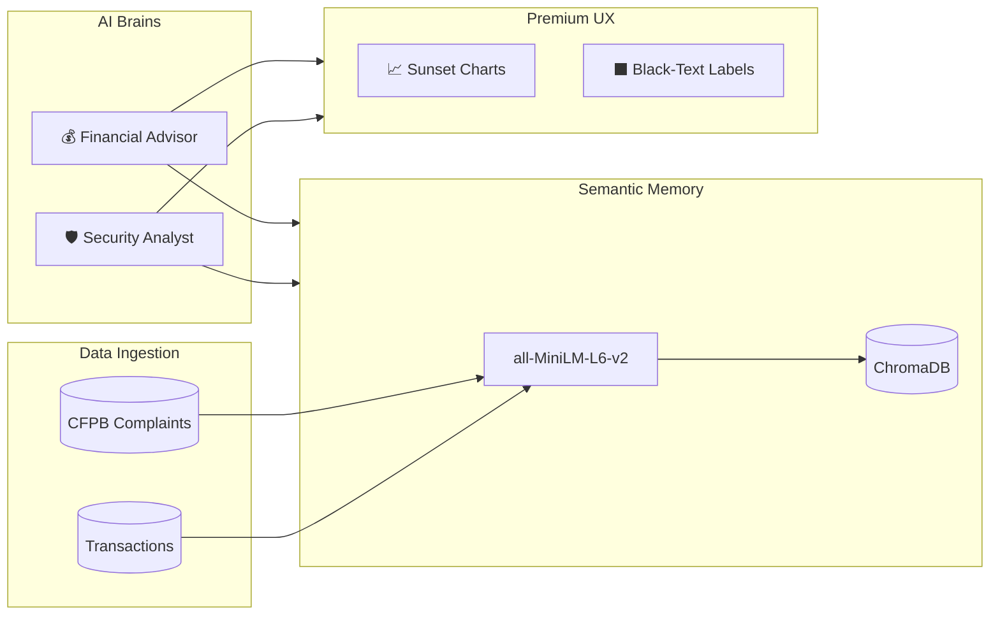
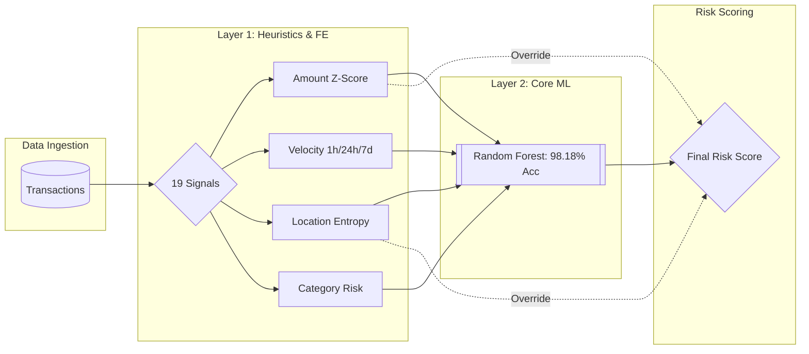
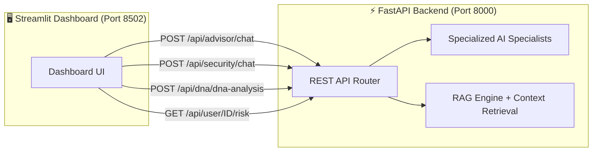

# Veriscan-Cortex — Advanced Fraud Intelligence & Private Multi-Agent Dashboard

> **Course:** CS 5588 — Data Science Capstone | **Date:** February 2026

---

## 📋 Table of Contents
- [Project Overview](#project-overview)
- [System Architecture](#system-architecture)
- [Visual Architecture](#visual-architecture)
- [Local AI Intelligence](#local-ai-intelligence)
- [Pipeline Workflow](#pipeline-workflow)
- [Repository Structure](#repository-structure)
- [Quick Start](#quick-start)

---

## Project Overview

Veriscan is an end-to-end **Fraud Detection & Security Platform** that processes transaction data through a multi-stage intelligence pipeline:

**Data Ingestion → Feature Engineering → Hybrid Fraud Modeling → Secure Identity Auth → Private Agentic AI**

### 🛡️ What is Veriscan?
The name **Veriscan** represents the fusion of two core security principles:
- **VERI** (*Verification & Veracity*): A commitment to absolute identity truth through dynamic authentication and data-backed evidence.
- **SCAN** (*Scanning & Surveillance*): The power of autonomous agentic "scans" that explore transaction history, risk profiles, and now personalized financial advice.

### 🌟 Premium AI Specialized Agents
The dashboard features a dual-model specialization for mission-critical tasks:
1. **🛡️ Security AI Analyst**: Dedicated to real-time fraud detection, system shield monitoring, and anomaly detection protocols.
2. **💰 Financial AI Advisor**: A high-fidelity agent that provides comprehensive (>300 word) advisory reports on credit health, savings plans, and spending optimization.
3. **🧬 Spending DNA**: An 8-axis behavioral fingerprinting system for advanced identity verification and trust scoring.


## Visual Architecture

### 🧠 How the AI "Brain" Works
Veriscan-Cortex works like a professional security team. Instead of one slow AI doing everything, we used **specialized agents** that work together in a split second.


```mermaid
graph TD
    User([User Query]) --> ModelSelector{🔍 Model Selection}
    
    ModelSelector -->|Security Mode| SecAnalyst[🛡️ Security AI Analyst]
    ModelSelector -->|Financial Mode| FinAdvisor[💰 Financial AI Advisor]

    subgraph Security_Domain [Security Intelligence]
        SecAnalyst --> Scanner[🔍 System Scanner]
        SecAnalyst --> Profile[👤 User Investigator]
        Scanner --> Shield[🛡️ Shield Monitor]
    end

    subgraph Financial_Domain [Advisory Intelligence]
        FinAdvisor --> Credit[💳 Credit Impact]
        FinAdvisor --> Savings[💰 Savings Plan]
        FinAdvisor --> Vector[📈 Vector Analysis]
    end

    Security_Domain --> Report[Detailed Security Audit]
    Financial_Domain --> Report2[300+ Word Advisory Report]
```

#### 🧩 The Roles:
| Agent | Role | "The Personality" |
| :--- | :--- | :--- |
| **Guard (Router)** | The Receptionist | Decides instantly who is best to answer your question. |
| **Scanner** | The Watchman | Scans the whole system for high-risk threats in milliseconds. |
| **Profile** | The Private Eye | Looks deep into a specific user's history and risk scores. |
| **Knowledge** | The Lawyer | Knows all the CFPB rules and fraud theory by heart. |
| **Synthesis** | The Chief Analyst | The "Deep Thinker" that combines all data into a final report. |

#### 🔄 The Process:
1. **Listen:** The **Guard** hears your question.
2. **Assign:** If you ask for a user's risk, the **Profile** agent handles it. If it's a complex "What if?" question, the **Synthesis** agent takes over.
3. **Remember:** The **Memory** system ensures the AI remembers what you talked about earlier.
4. **Report:** You get a professional, data-backed security analysis in seconds.

### 🔍 Multi-Stage RAG Architecture
The RAG system features a **Multi-Stage Retrieval** pipeline over **1,400+ local documents**. It uses semantic search followed by a **Re-ranking Layer** that prioritizes high-confidence Expert Fraud Intelligence (100+ expert QA pairs) over raw transaction context.


```mermaid
graph LR
    subgraph Ingestion [Data Ingestion]
        TXN[(Transactions)]
        CFPB[(CFPB Complaints)]
    end

    subgraph Specialized_Models [AI Brains]
        SEC[🛡️ Security Analyst]
        FIN[💰 Financial Advisor]
    end

    subgraph VectorDB [Semantic Memory]
        Embed[all-MiniLM-L6-v2]
        Chroma[(ChromaDB)]
    end

    subgraph UI [Premium UX]
        Chart[📈 Sunset Charts]
        Text[⬛ Black-Text Labels]
    end

    TXN --> Embed
    CFPB --> Embed
    Embed --> Chroma
    SEC --> VectorDB
    FIN --> VectorDB
    SEC --> UI
    FIN --> UI
```

### 🛡️ Hybrid Fraud Intelligence (ML + Heuristics)
The scoring engine combines 19 statistical "Heuristic Signals" with a supervised **Random Forest Classifier** to learn non-linear fraud signatures.


```mermaid
graph LR
    subgraph Data [Data Ingestion]
        TXN[(Transactions)]
    end

    subgraph FE [Layer 1: Heuristics & FE]
        HEU{19 Signals}
        HEU --> Z[Amount Z-Score]
        HEU --> V[Velocity 1h/24h/7d]
        HEU --> E[Location Entropy]
        HEU --> R[Category Risk]
    end

    subgraph ML [Layer 2: Core ML]
        RF[[Random Forest: 98.18% Acc]]
    end

    subgraph Output [Risk Scoring]
        SCORE{Final Risk Score}
    end

    TXN --> HEU
    Z --> RF
    V --> RF
    E --> RF
    R --> RF
    RF --> SCORE
    Z -.->|Override| SCORE
    E -.->|Override| SCORE
```

---

## Local AI Intelligence

Veriscan features a cutting-edge, local-first AI stack designed for maximum data privacy and performance on Mac hardware.

- **LLM**: `Meta-Llama-3-8B-Instruct` (4-bit quantized).
- **Inference**: **MLX-LM** (Native GPU acceleration for M1/M2/M3 chips).
- **Embeddings**: `all-MiniLM-L6-v2` (Local execution via `sentence-transformers`).
- **Vector Database**: **ChromaDB** (Persistent local storage for RAG context).

---

## Repository Structure

```
Veriscan-Dashboard/
├── streamlit_app.py                    # Aggregator UI (Consumes Microservices)
├── api/                                # ⚡ FastAPI Microservices Layer
│   ├── main.py                         # REST API Router & Endpoints
│   └── schemas.py                      # Pydantic Data Models
├── Phase-2-Report.md                   # Technical Report
├── CONTRIBUTIONS.md                    # Team Breakdown
├── requirements.txt                    # Project Dependencies
│
├── agents/                             # 🤖 Specialized AI Agents
│   ├── base.py                         # Standardized Agent Interfaces
│   ├── financial_advisor_agent.py      # 💰 Financial Advisor Specialist
│   ├── memory.py                       # 🧠 Stateful Conversation Memory
│   └── spending_dna_agent.py           # 🧬 Behavioral Fingerprinting Agent
│
├── models/                             # Intelligence & Core Logic Layer
│   ├── local_llm.py                    # 🧠 MLX-LM Wrapper (Llama-3)
│   ├── guard_agent_local.py            # 🛡️ Security Analyst Facade
│   ├── rag_engine_local.py             # 🔍 RAG Engine (Local Indexing)
│   └── agent_tools_data.py             # ⚙️ Data Tools for Risk & Profiles
│
├── scripts/                            # Data Pipeline & Synthetic Data
│   ├── feature_engineering.py          # ⚙️ 19 Health Signals
│   ├── fix_agent_data.py               # 🩹 Data Reconciliation Utility
│   ├── generate_cfpb_dataset.py        # 🏦 Synthetic CFPB Compliant Data
│   ├── generate_financial_advisor_dataset.py # 💸 Advisor Context Generator
│   └── generate_spending_dna_dataset.py # 🧬 DNA Vector Generator
│
├── sql/                                # Snowflake SQL Layer
│   ├── create_tables.sql               # 📋 DDL: 5 Tables + 2 Views
│   └── analytical_queries.sql          # 📊 8 Analytical Queries
│
├── dataset/csv_data/                   # Production-Ready Data Store
│   ├── cfpb_credit_card.csv            # CFPB Complaints Base
│   ├── financial_advisor_dataset.csv   # 💰 Advisor Training/RAG Data
│   ├── fraud_detection_qa_dataset.json # 💡 Expert Intelligence Dataset
│   ├── fraud_scores_output.csv         # 🛡️ Hybrid ML Fraud Scores
│   ├── spending_dna_dataset.csv        # 🧬 Spending Fingerprints
│   └── pipeline_logs.csv               # Pipeline Audit Trail
│
└── docs/
    └── architecture_diagram.png        # System Architecture Diagram
```

---

## ☁️ Snowflake Data Platform

Veriscan integrates with **Snowflake** for scalable analytics and data warehousing.

| Table | Purpose |
|-------|--------|
| `RAW_TRANSACTIONS` | Source transaction data |
| `TRANSACTION_FEATURES` | 19 engineered signals |
| `FRAUD_SCORES` | ML + heuristic risk scores |
| `AUTH_PROFILES` | User security profiles |
| `PIPELINE_RUNS` | Pipeline audit trail |

**Views:** `ENRICHED_TRANSACTIONS` (joined data), `USER_RISK_DASHBOARD` (aggregated risk)

See `sql/create_tables.sql` for schema DDL and `sql/analytical_queries.sql` for 8 production-ready queries.

---

## 🚀 Microservices Architecture

Veriscan uses a **decoupled microservices architecture**. The ML, RAG, and Agentic AI components run as a standalone **FastAPI backend**, and the Streamlit dashboard consumes them via REST API.


```mermaid
graph LR
    subgraph Frontend ["🖥️ Streamlit Dashboard (Port 8502)"]
        UI[Dashboard UI]
    end

    subgraph Backend ["⚡ FastAPI Backend (Port 8000)"]
        API[REST API Router]
        Agent[Specialized AI Specialists]
        RAG[RAG Engine + Context Retrieval]
    end

    UI -->|POST /api/advisor/chat| API
    UI -->|POST /api/security/chat| API
    UI -->|POST /api/dna/dna-analysis| API
    UI -->|GET /api/user/ID/risk| API
    API --> Agent
    API --> RAG
```

### API Endpoints

| Method | Endpoint | Description |
|--------|----------|-------------|
| `GET` | `/api/health` | Health check & loaded services |
| `POST` | `/api/fraud/predict` | Single-transaction fraud prediction |
| `GET` | `/api/fraud/high-risk?limit=N` | Top N riskiest transactions |
| `GET` | `/api/user/{user_id}/risk` | User risk profile |
| `POST` | `/api/agent/investigate` | Full agentic investigation (Supports `session_id`) |
| `POST` | `/api/rag/query` | Semantic knowledge search (Multi-stage re-ranking) |
| `POST` | `/api/advisor/chat` | AI Advisor Chat (Fraud, Categories, Savings) |
| `GET` | `/api/dna/{user_id}` | Generate Spending DNA 8-axis profile |
| `POST` | `/api/dna/compare` | Compare current session vs. DNA baseline |

---

## Quick Start

### 1. Requirements
- macOS with Apple Silicon (M1/M2/M3)
- Python 3.9+ (Anaconda environment recommended)

### 2. Install Dependencies
```bash
pip install -r requirements.txt
```

### 3. Run the Data Pipeline
```bash
# Prepare dataset (requires fraudTrain.csv in dataset/csv_data/)
python scripts/prepare_fraud_data.py

# Train the fraud model
python models/train_fraud_model.py

# Sync agent data files
python scripts/fix_agent_data.py
```

### 4. Launch the API Backend
```bash
uvicorn api.main:app --host 0.0.0.0 --port 8000
```

### 5. Launch the Dashboard (separate terminal)
```bash
streamlit run streamlit_app.py --server.port 8502
```
*Note: On first run, the Llama-3 model (~4.9GB) will be downloaded automatically.*

---

## 🔄 Reproducibility & Deployment

| Aspect | Details |
|--------|--------|
| **Environment** | Python 3.9+, dependencies in `requirements.txt` |
| **Model Versioning** | `fraud_model_rf.joblib` + `encoders.joblib` (deterministic `random_state=42`) |
| **Dataset** | Kaggle `kartik2112/fraud-detection` (download separately). Note: The preparation script now utilizes **5x Fraud Oversampling** to ensure sufficient risk events scale for downstream analytics. |
| **Vector Store** | ChromaDB (rebuilt on demand via `rag_engine_local.py`) |
| **Config** | `scripts/ingest_config.yaml` (supports env var overrides) |
| **Secrets** | All credentials via environment variables; `.env` in `.gitignore` |

